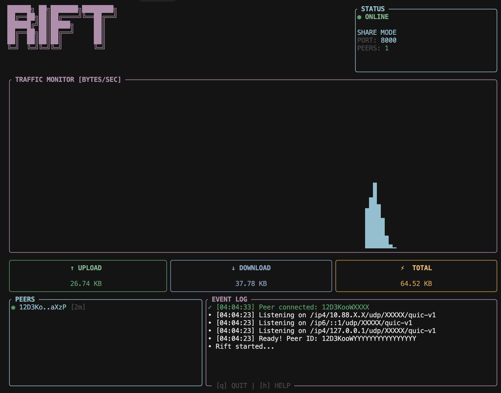

<div align="center">

# ⚡ Rift

**Your teammate's localhost. On your localhost.**

[](https://www.rust-lang.org)
[](LICENSE)
[](https://libp2p.io)

<br>



<br>

**Stop deploying to staging. Stop screen-sharing. Stop Slack-ing `.env` screenshots.**

</div>

---

## What's This?

Remember when your teammate said *"works on my machine"* and you wanted to just... use their machine?

**Now you can.**

Rift makes their `localhost:3000` appear on *your* `localhost:3000`. Encrypted. P2P. No public URLs.

```
Your machine                    Teammate's machine
localhost:3000  ◄─ encrypted ─►  localhost:3000
```

Debug against the *actual* thing that's broken, not a "reproduction" that mysteriously works.

---

## Install

**Homebrew (recommended):**
```bash
brew install n33levo/rift/rift
```

**From source:**
```bash
git clone https://github.com/n33levo/rift
cd rift && cargo build --release
```

---

## 30-Second Demo

```bash
# Teammate A (sharing their service)
rift share 3000

# Teammate B (connecting)
rift connect rift://12D3KooW.../3000
```

Done. B's `localhost:3000` → A's service. Encrypted, P2P.

**With env config:**
```bash
rift share 3000 --secrets .env.rift
rift connect rift://... --request-secrets --save-secrets .env
```

---

## Why Rift?

- 🚫 **No staging deploys** — tunnel straight to their machine
- 🔑 **No "send me your .env"** — encrypted config handoff built-in  
- 🔒 **No accidental exposure** — localhost binding, explicit Y/N approval
- ⚡ **Share anything** — APIs, databases, Streamlit, Jupyter, GPU servers

[→ More use cases](docs/USE_CASES.md)

---

## How It Works

**mDNS discovery** → **QUIC tunnel** → **Y/N approval** → **TCP bridge**

Built on [libp2p](https://libp2p.io). Encrypted end-to-end (X25519 + ChaCha20-Poly1305). NAT hole-punching.

[→ Architecture details](docs/HOW_IT_WORKS.md)

---

## Security

- 🔐 **E2E encrypted** — X25519, ChaCha20-Poly1305
- 👤 **Explicit approval** — every connection needs host's Y/N
- 🏠 **Localhost by default** — not exposed to your network
- 🔑 **Secrets opt-in** — AES-256-GCM, session-only

[→ Security details](docs/SECURITY.md)

---

## Not For

❌ Public URLs → use ngrok  
❌ Production → use real infra  
❌ Untrusted people → made for teammates

---

## FAQ

**Q: Like ngrok?**  
A: If ngrok and SSH had a baby raised by libp2p. No public URLs.

**Q: Why not SSH tunnels?**  
A: It's 2026. We have better things to debug.

**Q: Multiple ports?**  
A: Run `rift share` in multiple terminals.

**Q: Works over internet?**  
A: Yes. Relay bootstrap → NAT hole-punch → direct P2P.

---

## Docs

- [Usage Guide](docs/USAGE.md)
- [Use Cases](docs/USE_CASES.md)
- [Security](docs/SECURITY.md)
- [How It Works](docs/HOW_IT_WORKS.md)

---

## Contributing

[CONTRIBUTING.md](CONTRIBUTING.md)

---

<div align="center">

**MIT License**

*"AirDrop for localhost ports"*

[⭐ Star if you've ever said "works on my machine" ⭐](https://github.com/n33levo/rift)

</div>
