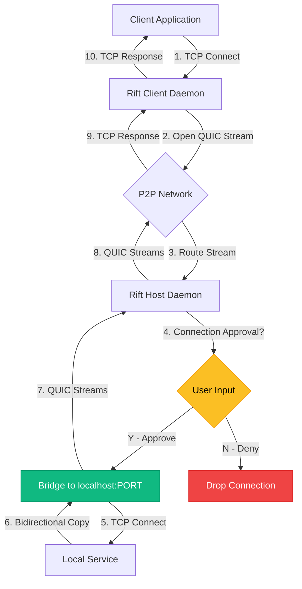

<div align="center">

# ⚡ Rift: Pairing-Grade Localhost Tunneling

### **AirDrop for Localhost** — share ports *and* context (secrets/config) peer-to-peer.

[](https://www.rust-lang.org)
[](LICENSE)
[](CONTRIBUTING.md)
[](https://libp2p.io)
[](https://www.chromium.org/quic)

[Quick Start](#-quick-start) • [Security](#-security--trust-read-this-first) • [Features](#-features) • [Architecture](#-how-it-works)

</div>

Your service appears on *your teammate's* `localhost:8080`, not a public URL. No relay servers, no surprise visitors, no copy-pasting `.env` files in Slack.

**Not meant for public hosting** — use ngrok or Cloudflare Tunnel for that. Rift is for **pairing and debugging with teammates** you trust.

---

## Why Rift?

**Local-to-local port mapping:**  
When you share port 3000, your peer accesses it on *their own* `localhost:3000` — not via a public URL. It's like they're running your service locally.

**Config parity in seconds:**  
Optionally sync environment variables or config files so your peer connects with the right credentials. No more "can you send me your `.env`?" in Slack.

**Explicit trust:**  
Every inbound connection requires host approval. No magic links that bypass consent.

---

## 🔒 Security & Trust (Read This First)

- 🔒 **No magic links:** Every inbound connection requires explicit host approval (Y/N prompt). You control who connects.
- 🔒 **Encrypted by default:** All tunnel traffic and secret payloads use the **Noise Protocol** with **ChaCha20-Poly1305** encryption.
- 🔒 **Peer-to-peer:** Direct QUIC transport between peers. No central server sees your data.
- 🔒 **Secrets sharing is opt-in:** Rift never silently uploads secrets. The host explicitly chooses what to share (`--secrets .env`), and the peer must request them (`--request-secrets`).
- 🔒 **Host controls exposure:** You decide which ports to share and which secrets (if any) to include.

**Trust model:** Rift assumes you're pairing with teammates you trust. It's not a public hosting platform with access controls — it's a direct peer-to-peer tool.

---

## ✨ Features

### Pairing Workflow
- **Connection approval required:** Host gets a Y/N prompt before accepting connections
- **Instant clipboard sharing:** `rift://` link copied automatically
- **Local-first binding:** Client binds to `127.0.0.1` by default (add `--public` only if needed)
- **TUI dashboard:** Real-time connection status, traffic graphs, event logs

### Networking
- **QUIC transport:** Fast, multiplexed streams (same protocol as HTTP/3)
- **Peer discovery:** mDNS for local networks, relay for remote peers
- **NAT hole punching:** DCUtR establishes direct P2P connections
- **Noise Protocol encryption:** End-to-end security using Noise_XX with X25519 keys

### Secrets / EnvVault (Optional)
- **Encrypted secret sharing:** X25519 (ECDH) + AES-256-GCM for environment variables
- **Explicit opt-in:** Host uses `--secrets .env`, peer uses `--request-secrets`
- **Auditable:** Both sides see exactly what's being shared

---

## Example: Backend ↔ Frontend Pairing in Seconds

**Scenario:** Backend dev (Peer A) needs to test with frontend dev (Peer B). Backend runs on port 3000 and needs specific API keys.

**Peer A (Backend developer):**
```bash
# Share port 3000 with selected environment variables
rift share 3000 --secrets .env

# Rift generates a link and copies to clipboard
# Link: rift://12D3KooWLYABwLi4LYBgfP35fanr3Mqh1aczuS7by7171AHzAaXs
```

**Peer B (Frontend developer):**
```bash
# Connect using the link, request secrets, map to local port 3000
rift connect rift://12D3KooWLYABwLi4LYBgfP35fanr3Mqh1aczuS7by7171AHzAaXs --request-secrets

# Peer A sees approval prompt and presses 'Y'
# Peer B's terminal shows:
# ✅ Tunnel established at http://127.0.0.1:3000
# 🔐 Secrets received and ready
```

**Result:** Peer B can now hit `localhost:3000` and the traffic flows to Peer A's backend. Secrets are injected into the environment automatically. Debugging starts immediately.

---

## 🎬 See It In Action

**Peer A (Share a port):**
```bash
$ rift share 3000 --secrets .env

📋 Link copied to clipboard!

╔══════════════════════════════════════════════════════════════╗
║                     🔑 Rift Share                            ║
╠══════════════════════════════════════════════════════════════╣
║ Sharing: localhost:3000                                      ║
║ Share this link: rift://QmXJ7k9fW8tQ2zRv3PkL...              ║
╚══════════════════════════════════════════════════════════════╝

# Connection approval popup appears when someone connects
⚠ INCOMING CONNECTION REQUEST
Peer: QmAbc...def
Allow this connection? [Y] Accept  [N] Deny
```

**Peer B (Connect):**
```bash
$ rift connect rift://QmXJ7k9fW8tQ2zRv3PkL... --request-secrets

╔══════════════════════════════════════════════════════════════╗
║                    🔗 Rift Connect                           ║
╠══════════════════════════════════════════════════════════════╣
║ Tunnel established! Access at: http://127.0.0.1:3000         ║
╚══════════════════════════════════════════════════════════════╝

🔐 Successfully received and decrypted shared secrets!
```

### Connection Flow (Interactive Diagram)

```mermaid
sequenceDiagram
    participant DevA as 💻 Peer A (Host)
    participant RiftA as ⚡ Rift Daemon
    participant Net as 🌐 P2P Network (QUIC)
    participant RiftB as ⚡ Rift Client
    participant DevB as 💻 Peer B (Connector)

    DevA->>RiftA: rift share 3000 --secrets .env
    RiftA->>Net: Announce Identity (DHT/mDNS)
    Note over RiftA: 📋 Link copied to clipboard!

    DevB->>RiftB: rift connect rift://...
    RiftB->>Net: Discover Peer A
    Net->>RiftA: Incoming Connection Request
    RiftA-->>DevA: 🔔 Approve Connection? (Y/N)
    DevA->>RiftA: Press 'Y'

    rect rgb(30, 30, 30)
        Note over RiftA,RiftB: 🔒 Encrypted Tunnel (Noise_XX + QUIC)
        RiftB->>RiftA: Request Secrets
        RiftA->>RiftB: Send Encrypted .env (X25519+AES-GCM)
        RiftB-->>DevB: ✅ Secrets Injected
        DevB->>RiftB: curl http://127.0.0.1:3000
        RiftB->>Net: QUIC Stream → Peer A
        Net->>RiftA: Forward Request
        RiftA->>DevA: localhost:3000
        DevA-->>RiftA: HTTP Response
        RiftA-->>Net: QUIC Stream ← Peer A
        Net-->>RiftB: Forward Response
        RiftB-->>DevB: HTTP Response
    end
```



---

## 🚀 Quick Start

### Prerequisites

- **Rust 1.75+** (install via [rustup.rs](https://rustup.rs))
- **macOS, Linux, or Windows**

### Installation

```bash
# Install from source
cargo install --git https://github.com/yourusername/rift

# Or clone and build
git clone https://github.com/yourusername/rift
cd rift
cargo build --release
# Binary at ./target/release/rift
```

**Coming Soon:**
- 🍺 Homebrew: `brew install rift`
- 📦 Pre-built binaries for all platforms

### Share a Local Port

```bash
# Start sharing port 3000
rift share 3000

# With secrets from .env file
rift share 3000 --secrets .env

# Auto-approve all connections (for trusted networks)
rift share 3000 --auto-approve
```

### Connect to a Peer

```bash
# Connect to a shared port
rift connect rift://QmXJ7k9fW8tQ2zRv...

# Connect on a different local port
rift connect rift://QmXJ7k9fW8tQ2zRv... -l 8080

# Allow connections from your network (bind to 0.0.0.0)
rift connect rift://QmXJ7k9fW8tQ2zRv... --public

# Request and save shared secrets
rift connect rift://QmXJ7k9fW8tQ2zRv... --request-secrets --save-secrets .env.remote
```

### Advanced: Headless/CI Mode

```bash
# Run without TUI (for scripts)
rift share 3000 --no-tui --auto-approve

# Combine with verbose logging
rift share 3000 --verbose --no-tui
```

---

## 🏗️ How It Works

Rift is built on **libp2p** (the same networking stack powering IPFS and Filecoin) with **QUIC** transport for maximum performance.

### System Architecture


### Technical Deep Dive

**What Happens Under the Hood:**

1. **Peer Discovery**: Uses mDNS for local networks, relay servers for remote peers
2. **NAT Hole Punching**: DCUtR (Direct Connection Upgrade through Relay) establishes direct P2P connections
3. **Noise Protocol**: End-to-end encryption using Noise_XX with X25519 keys
4. **QUIC Streams**: Multiplexed, reliable byte streams over UDP (like HTTP/3)
5. **Zero-Copy Bridge**: Direct TCP ↔ QUIC byte pumping with `tokio::io::copy`

### Data Flow Diagram



### Security Model

- **🔐 Connection Approval**: Host must explicitly approve each incoming peer (unless `--auto-approve` is set)
- **🔒 Noise Encryption**: All traffic encrypted end-to-end with the Noise protocol
- **🔑 Secrets Vault**: Environment variables encrypted with X25519 (ECDH) + AES-256-GCM
- **🏠 Localhost Default**: Client binds to `127.0.0.1` unless you explicitly use `--public`

---

## 📖 Documentation

### Command Reference

#### `rift share <PORT>`

Share a local port with peers.

**Options:**
- `-s, --secrets <FILE>` - Share environment variables from a file
- `--auto-approve` - Skip connection approval (for trusted networks)
- `--no-tui` - Disable the TUI dashboard
- `-v, --verbose` - Enable debug logging

**Example:**
```bash
rift share 3000 --secrets .env
```

#### `rift connect <LINK>`

Connect to a shared port.

**Options:**
- `-l, --local-port <PORT>` - Local port to bind (defaults to remote port)
- `--public` - Bind to `0.0.0.0` instead of `127.0.0.1`
- `--request-secrets` - Request shared secrets from the peer
- `--save-secrets <FILE>` - Save received secrets to a file
- `--no-tui` - Disable the TUI dashboard
- `-v, --verbose` - Enable debug logging

**Example:**
```bash
rift connect rift://QmAbc... -l 8080 --request-secrets --save-secrets .env
```

#### `rift info`

Display your peer ID and connection link.

---

## 🛠️ Development

### Build from Source

```bash
git clone https://github.com/yourusername/rift
cd rift
cargo build --release

# Binary will be at ./target/release/rift
```

### Run Tests

```bash
# Run all tests
cargo test

# Run with verbose output
cargo test -- --nocapture

# Run specific test
cargo test -p wh-core --test tunnel_integration
```

### Project Structure

```
rift/
├── crates/
│   ├── wh-core/         # Core P2P networking and tunneling
│   │   ├── network/     # libp2p swarm, QUIC transport, protocols
│   │   ├── secrets.rs   # EnvVault encryption (X25519 + AES-GCM)
│   │   └── proxy/       # TCP ↔ QUIC stream bridging
│   ├── wh-daemon/       # Background daemon and session management
│   └── wh-cli/          # CLI and cyberpunk TUI
│       ├── cli/         # Command implementations
│       └── tui/         # Terminal UI with ratatui
└── target/release/rift  # Compiled binary
```

---

## 🤝 Contributing

Contributions are welcome! Whether it's:

- 🐛 Bug reports
- 💡 Feature requests
- 📝 Documentation improvements
- 🔧 Code contributions

Please open an issue or submit a PR.

### Roadmap

- [ ] Homebrew formula
- [ ] Pre-built binaries for macOS/Linux/Windows
- [ ] Custom domain support (`rift share 3000 --domain myapp.local`)
- [ ] QR code generation for mobile connections
- [ ] Plugin system for custom protocols
- [ ] Web UI alternative to TUI

---

## License

MIT License - see [LICENSE](LICENSE) for details.

---

## Acknowledgments

Built with:
- [libp2p](https://libp2p.io) - Modular P2P networking stack
- [QUIC](https://www.chromium.org/quic) - Modern transport protocol
- [Tokio](https://tokio.rs) - Async runtime for Rust
- [ratatui](https://ratatui.rs) - Terminal UI framework

Inspired by ngrok, localtunnel, and the dream of a truly peer-to-peer internet.

---

<div align="center">

**Made with ⚡ by developers, for developers**

If you find this useful, consider giving it a star ⭐

</div>
